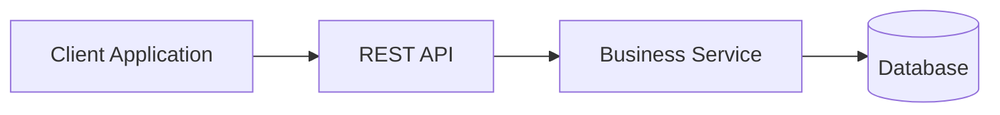

# Architecture Overview

## REST Integration

## Integration Responsibilities

| Component | Responsibility |
|------------|----------------|
| Client | Sends requests |
| API | Validates and routes requests |
| Business Service | Executes business logic |
| Database | Stores application data |

---

## Integration Considerations

- Authentication
- Authorization
- Error Handling
- Logging
- Monitoring
- Scalability