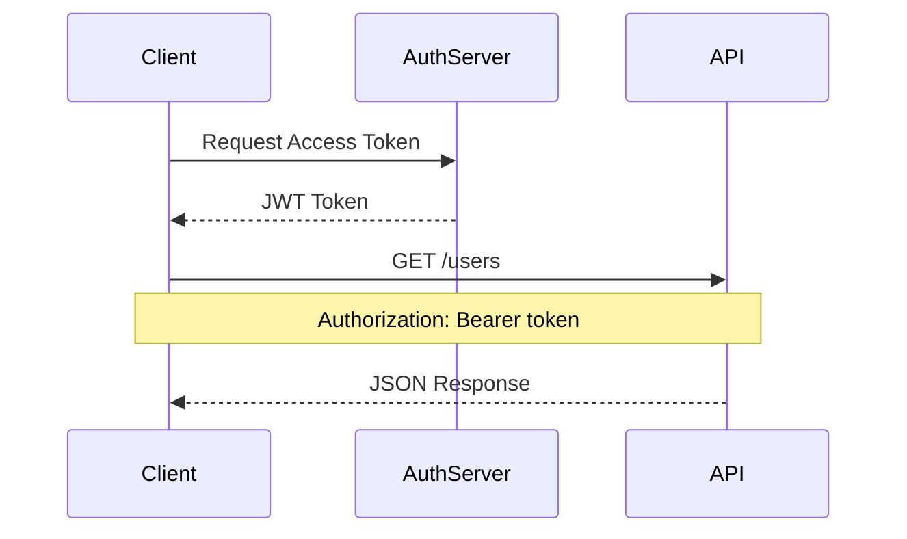

# OAuth 2.0 Client Credentials Flow

```mermaid
sequenceDiagram

participant Client
participant AuthServer
participant API

Client->>AuthServer: Request Access Token

AuthServer-->>Client: JWT Token

Client->>API: GET /users
Note over Client,API: Authorization: Bearer token

API-->>Client: JSON Response
```