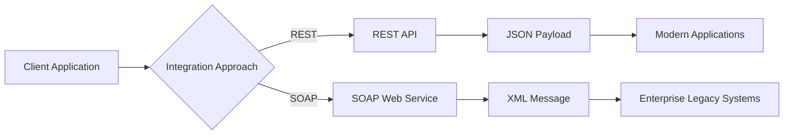
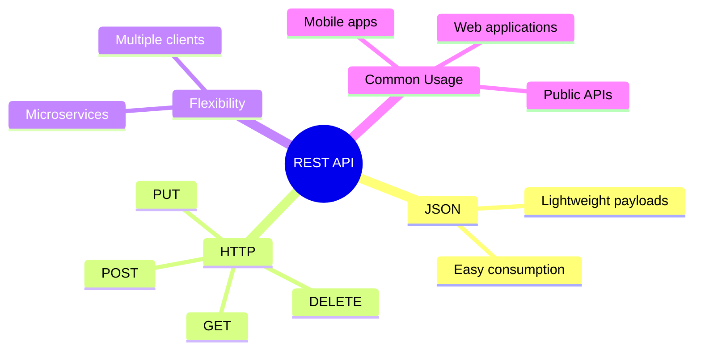
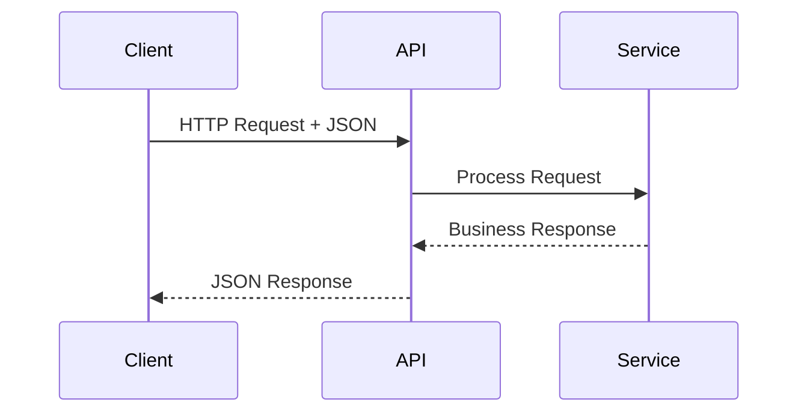
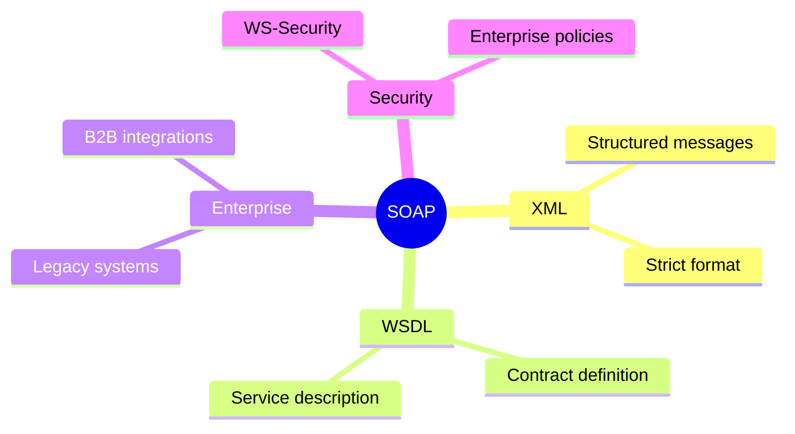
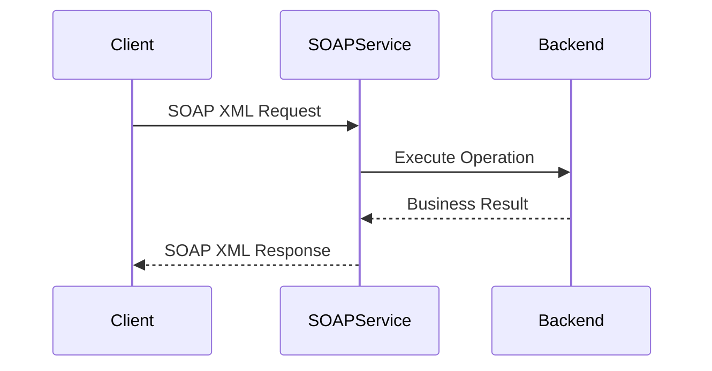
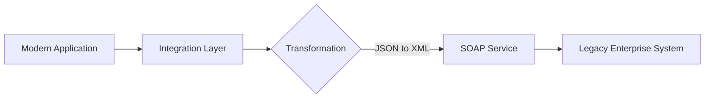
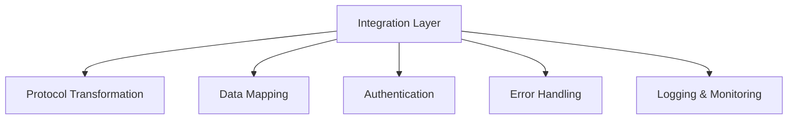
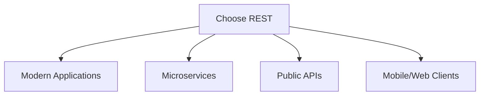

# REST vs SOAP Integration

## Overview

Modern enterprise environments often include both REST and SOAP services.

A Technical Consultant must understand the differences between these approaches and design integration strategies that allow different systems to communicate effectively.

---

## High-Level Comparison



## REST characteristics



## Typical REST Flow



## SOAP Characteristics



## Typical SOAP Flow



## REST to SOAP Integration Pattern

Many enterprise scenarios require a translation layer between modern applications and legacy platforms.


## Integration Layer Responsibilities


## When to use REST



## When to use SOAP

```mermaid
flowchart TD

A[Choose SOAP]

A --> B[Enterprise Legacy Systems]

A --> C[Contract-driven Services]

A --> D[B2B Integrations]

A --> E[Regulated Industries]

Consultant perspective

flowchart LR

A[Business Requirement]

--> B[System Landscape Analysis]

--> C[Integration Strategy]

--> D[Technology Choice]

--> E[Reliable Solution]

```

The goal is not choosing REST over SOAP.

The goal is selecting the right integration approach based on:

business requirements;
existing systems;
security needs;
maintainability;
long-term strategy.