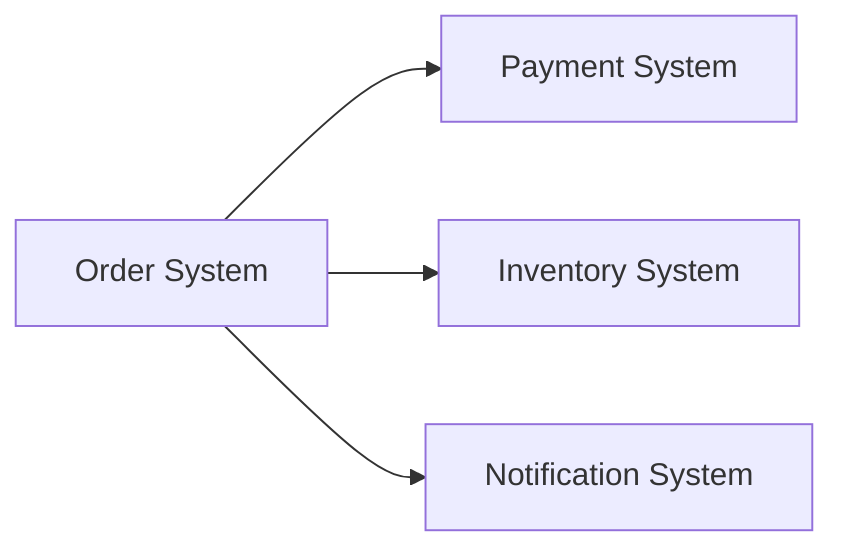
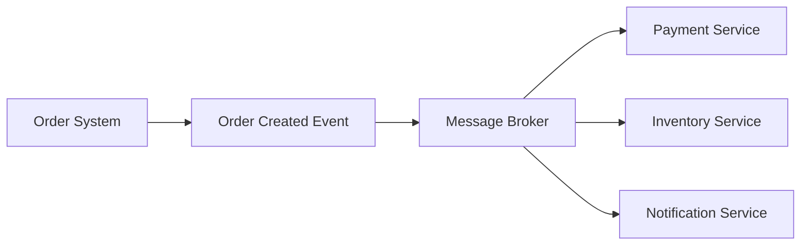

# Event-Driven Integration

## Overview

Not all integrations require a synchronous request-response model.

Event-driven architectures allow systems to communicate asynchronously by publishing and consuming events.

This approach improves scalability, resilience, and decoupling between applications.

---

## Business Scenario

A customer places an order in an e-commerce platform.

Multiple systems need to react:

- Inventory management
- Payment processing
- Customer notification
- Analytics platform

Instead of calling each system directly, the platform publishes an event.

---

## Traditional Approach

The order system is tightly coupled with multiple dependencies.

---

## Event-Driven Approach

---

## Topics Covered

- Webhooks
- Events
- Message brokers
- Retry strategies
- Idempotency
- Asynchronous communication