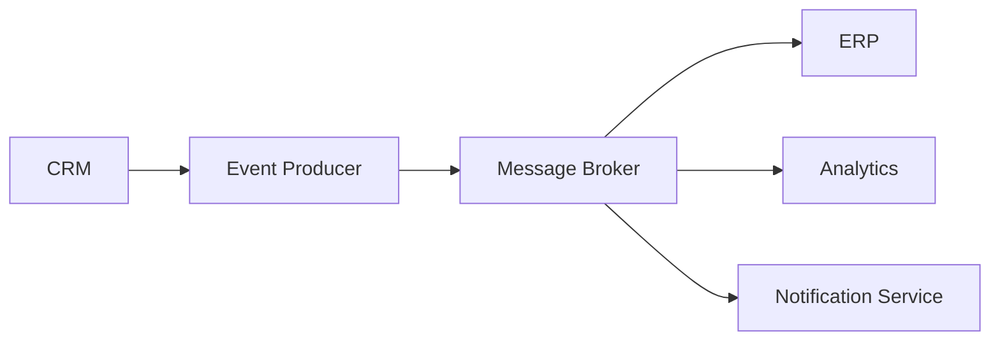

# Event Driven Architecture

---

## Components

| Component | Responsibility |
|-|-|
| Producer | Generates events |
| Broker | Routes messages |
| Consumer | Processes events |

---

## Consultant Perspective

When designing event-driven integrations, evaluate:

- Business requirements
- Processing latency
- Data consistency
- Failure handling
- Monitoring requirements