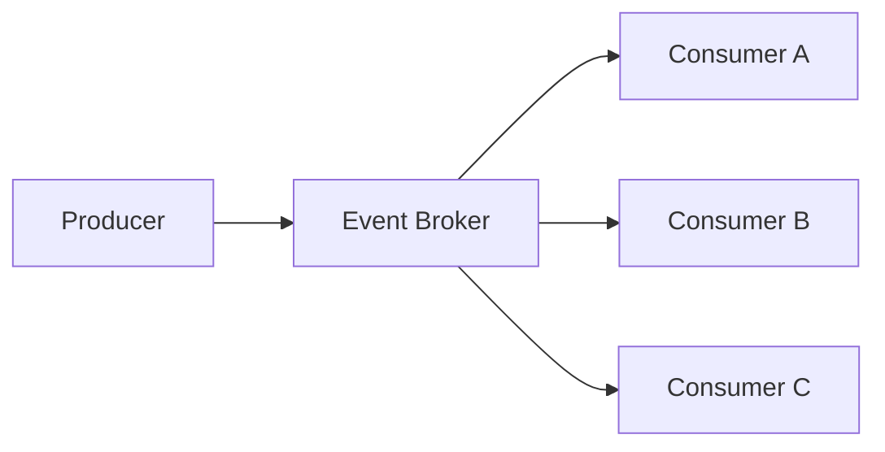

# Event Driven Patterns

## Publish / Subscribe

Multiple consumers can react to the same event.

---

## Benefits

- Loose coupling
- Scalability
- Independent systems
- Easier evolution

---

## Challenges

- Event ordering
- Duplicate messages
- Monitoring complexity
- Data consistency