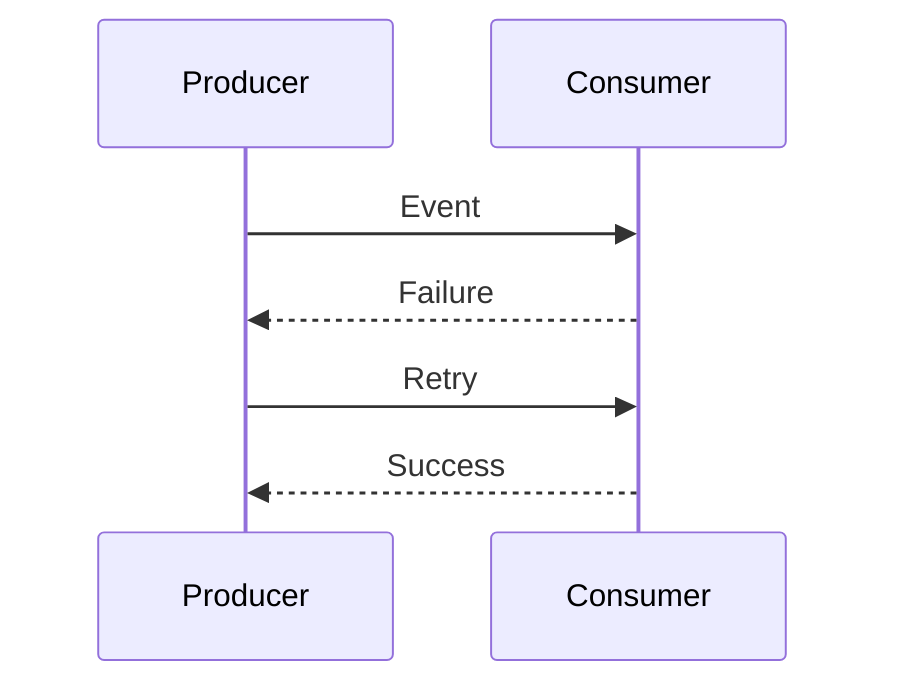

# Retry Strategy and Idempotency

## Why Retry?

Distributed systems can experience temporary failures:

- Network interruption
- Service unavailable
- Timeout

---

## Retry Example



---

## Idempotency

An operation is idempotent when executing it multiple times produces the same result.

Example:

First request:

```
Create Order 1001
```

Retry:

```
Create Order 1001
```

The system should avoid creating duplicates.

---

## Common Techniques

- Unique event ID
- Transaction tracking
- Duplicate detection
- Processing history