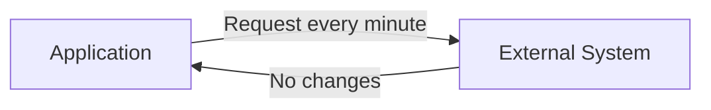
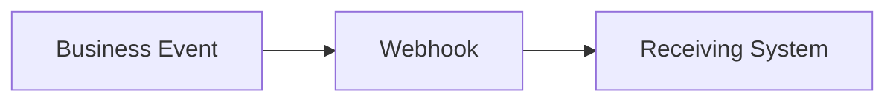

# Webhook Integration Example

## What is a Webhook?

A webhook is a mechanism where one system automatically sends information to another system when a specific event occurs.

Unlike polling, the receiving system does not continuously ask for updates.

---

## Polling vs Webhook



Polling creates unnecessary traffic.

---

Webhook model:



---

## Example Scenario

Event:

```
customer.created
```

Payload:

```json
{
  "event": "customer.created",
  "timestamp": "2026-01-01T10:00:00Z",
  "customerId": "1001"
}
```

---

## Webhook Considerations

Important aspects:

- Authentication
- Payload validation
- Retry handling
- Duplicate events
- Monitoring